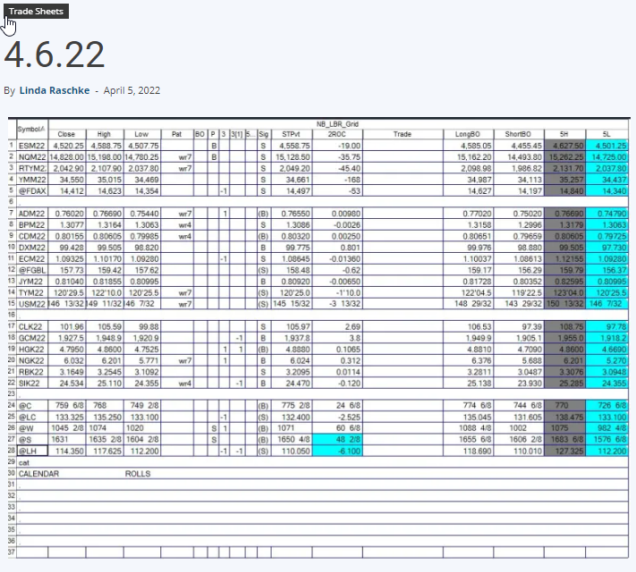
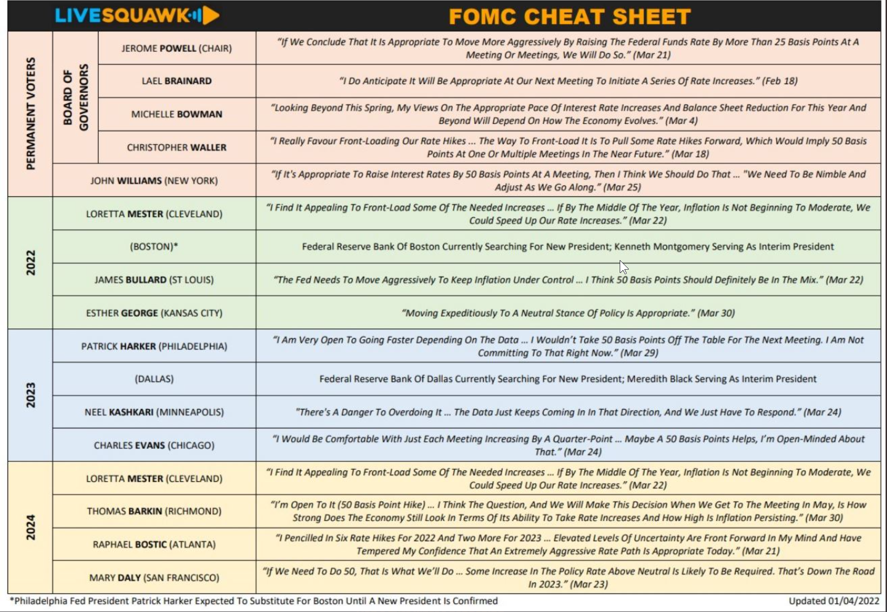
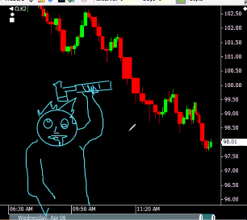
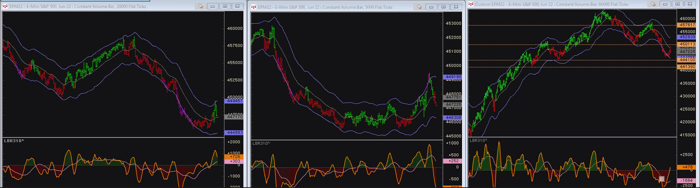

## Events

---

## Charts
---

## Posts

---

"spooked"

Investing.com -- Bond markets are under pressure again. U.S. yields are at three-year highs after the Fed's Lael Brainard warned of a faster tightening of policy, while the Eurozone's are spooked by the prospect of Marine Le Pen winning the French presidency later this month.

---

Commodities Super Cycle 

https://www.refinitiv.com/perspectives/future-of-investing-trading/is-this-the-start-of-a-commodities-supercycle/

## Screenshots

---

