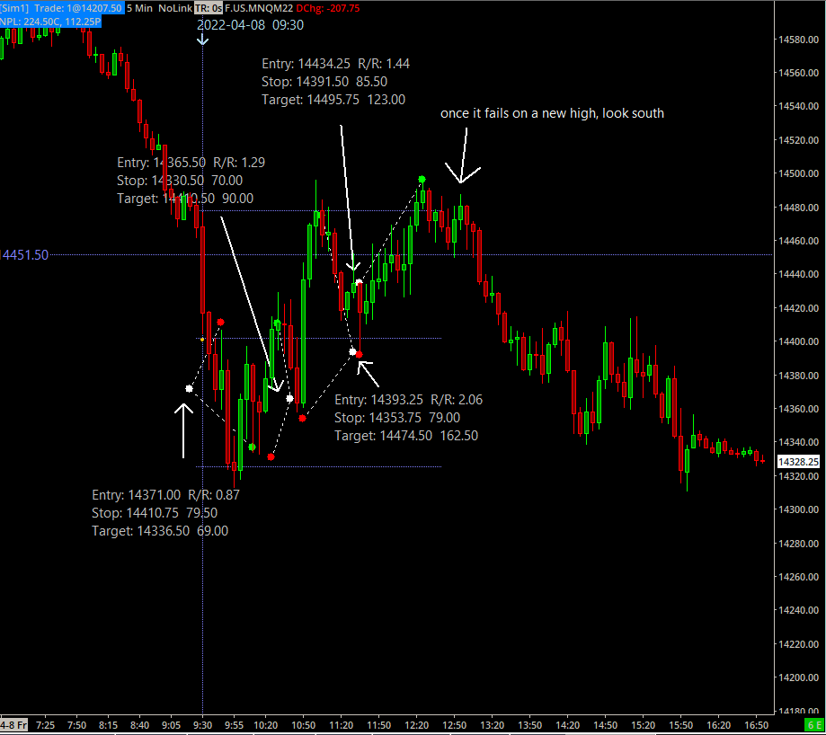
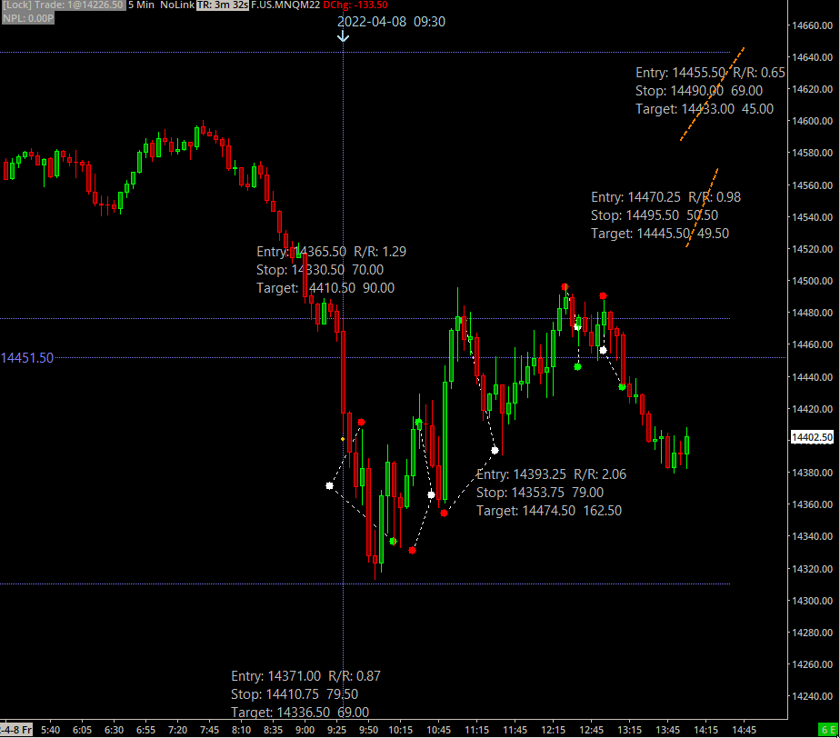

## Events

[Three Push Video](https://vimeo.com/604404237/78477ed969)

[Jeffrey P. Snider](https://alhambrapartners.com/2022/04/08/speaking-volumes-rather-than-fast-rate-hikes/)

---

## Charts

[Larger Image](20220408_000255.png)

---

## Posts

[From the WASDE report wheat section:](https://www.usda.gov/oce/commodity/wasde) 

Projected 2021/22 global trade is lowered 3.0 million tons to 200.1 million as lower exports by the EU, Ukraine, the United States, and Kazakhstan are not completely offset by higher exports by Russia, Brazil, and Argentina. EU exports are reduced 3.5 million tons to 34.0 million on a lower-than-expected pace. Russia’s exports are raised 1.0 million tons to 33.0 million as it continues to export at competitive prices. Ukraine’s exports are lowered 1.0 million tons to 19.0 million as its Black Sea ports remain closed since the invasion by Russia in February. The majority of Ukraine’s exports have already been shipped with limited additional amounts expected for the remainder of 2021/22. Projected 2021/22 world ending stocks are lowered 3.1 million tons to 278.4 million with India accounting for most of the reduction that is only partially offset by higher EU stocks. Global stocks are projected at a 5-year low.

 ---
 
 [Scare Piece](https://www.investing.com/news/economy/russia-hits-fleeing-civilians--le-pen-risk-food-prices--whats-moving-markets-2800536)
 
 ---
 
 

## Screenshots

---
Title: April  8,2022
subtitle: 
excerpt: Friday
date: 2022-04-08
author:
categories:
- April
-
-
-
draft: false
layout: single-series
weight:  8
---

## Events

---

## Charts
---

## Screenshots

