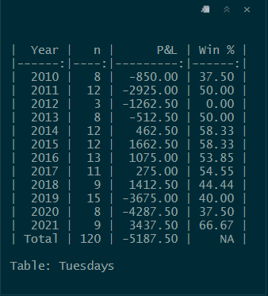

### Study 

**Data:** CQG   
**Years:** 2009-2021 

_**NOTE:**_ 03/09/2020, 03/12/2020, 03/16/2020 deleted. Missing morning data. 

**Session Window:** 09:30-15:59:59  
**Time Frame:** 5 Min  
**Condition:**  High > Prior High with Close > Open || reverse  
**Entry:** Close of bar 3  
**Exit:**  Close @ 15:59:59

--- 

---

---

---

---

---

---



  


  


  


  


  


  

