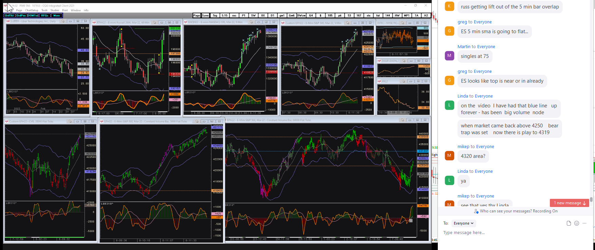

## Charts
---




 



 




 




  




## Events
---

10:45am - Biden to speak on Russia [WhiteHouse - YouTube](https://www.youtube.com/watch?v=riIbml4OyOY) 

13:00pm Apple event

---

## Screenshots

Fertalizer exports by Russia 2019 

---

Gold nearing all time highs. 

---

Linda made this assertion. In fact price turned down at the lower level and then tested lows. 

