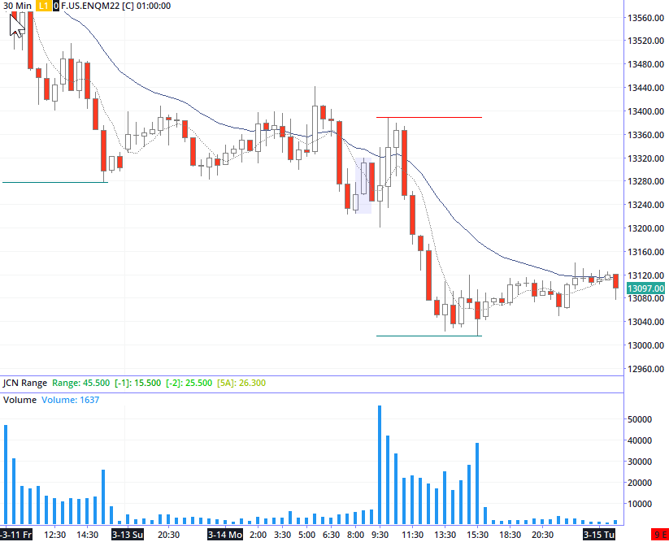
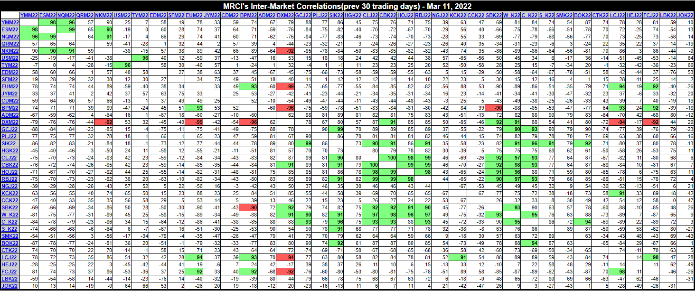
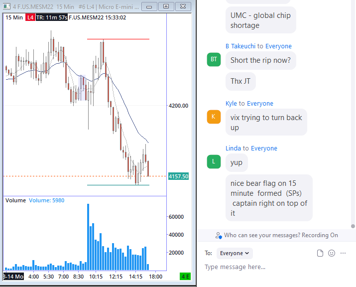

  

## Events
---

## Posts
---

if any are interested in reading a recent paper about de-dollarization, pdf version is free.

https://www.cambridge.org/core/elements/can-brics-dedollarize-the-global-financial-system/0AEF98D2F232072409E9556620AE09B0

---

## Screenshots

Steve Moore MRCI  market correlation table

---

---

Noting what is considered a "nice bear flag" on the 15m ES chart. 

