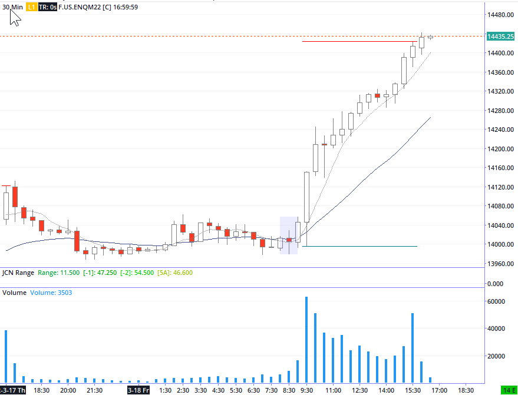
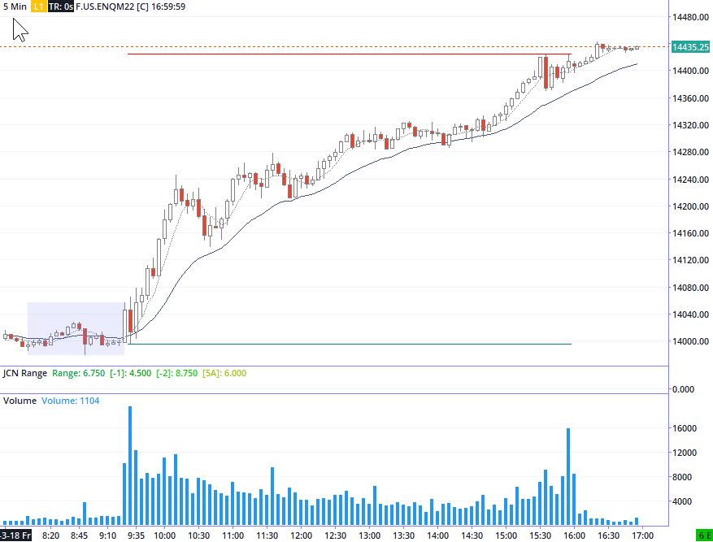
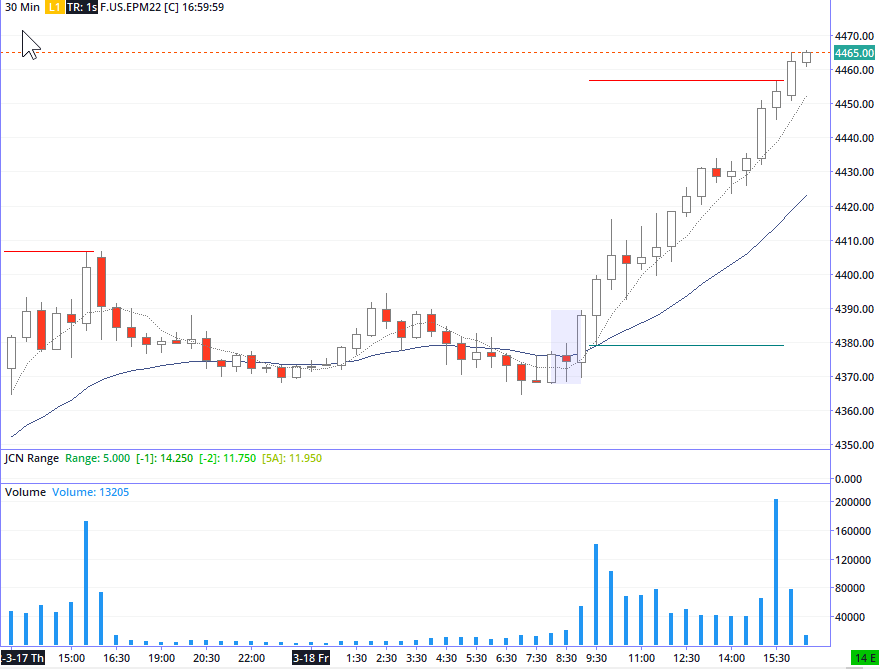
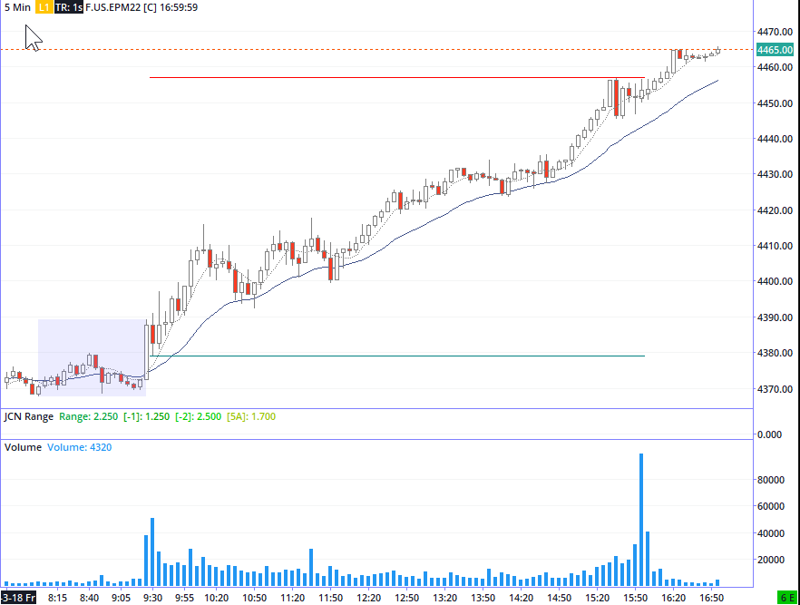
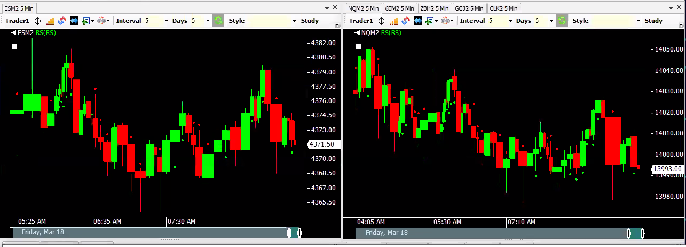
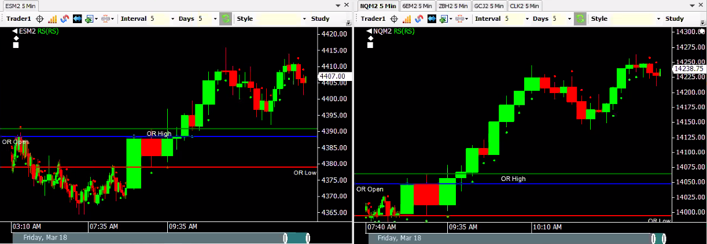
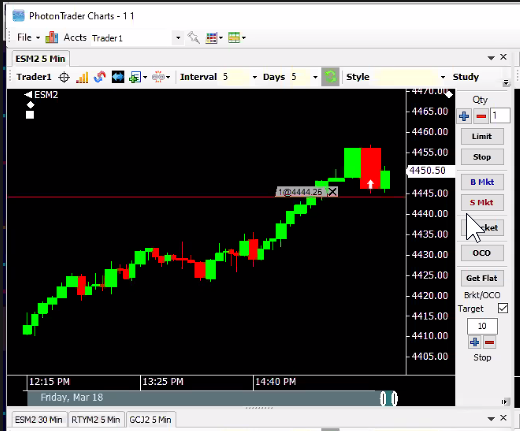
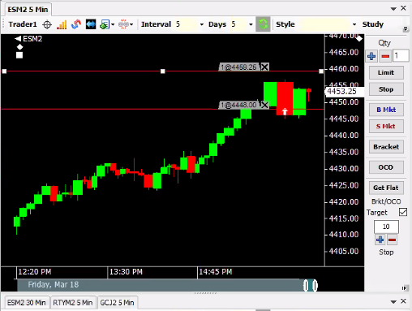

## Events
---
Options expiration 

"keeping your powder dry, is a win."

## Charts
---




  



  



  



  




## Screenshots
---

PAV Dots on 5 minute overnight charts 3/17 into 3/18

---

PAV Dots on 5 minute trending 3/18

---

Trade first red bar down in a strong trend, " shake the weak longs out"  
note Stop Location and Target.  

This trade failed, after moving stop to breakeven the market dropped lower and then resumed the uptrend . 

---

