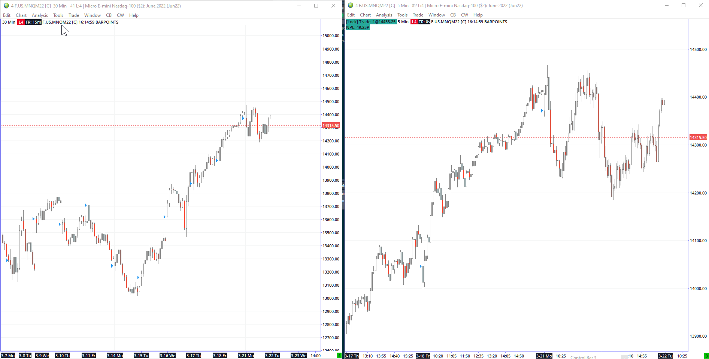
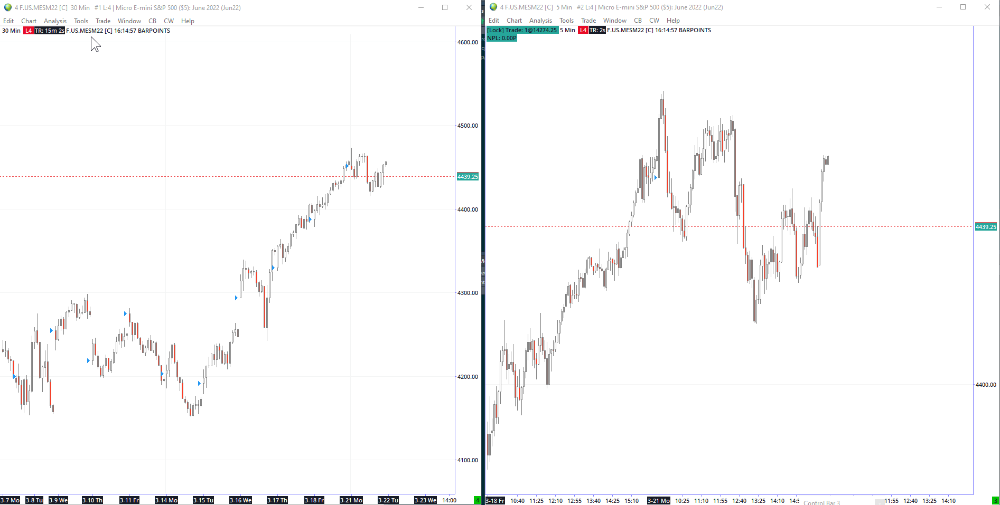
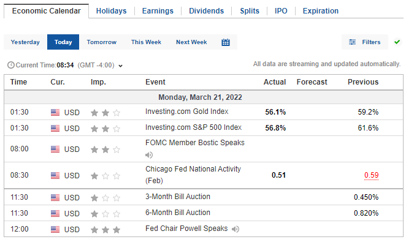
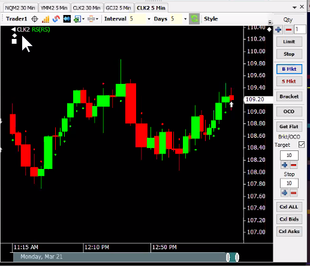
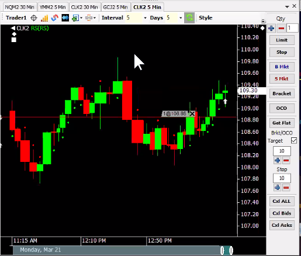
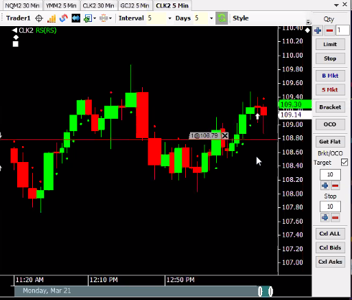
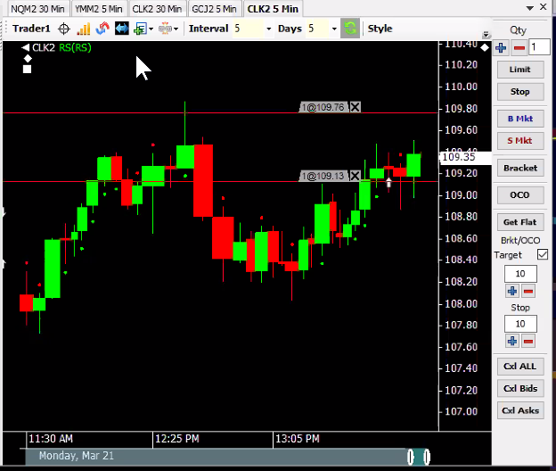
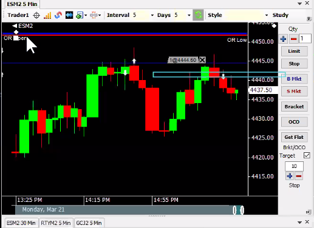
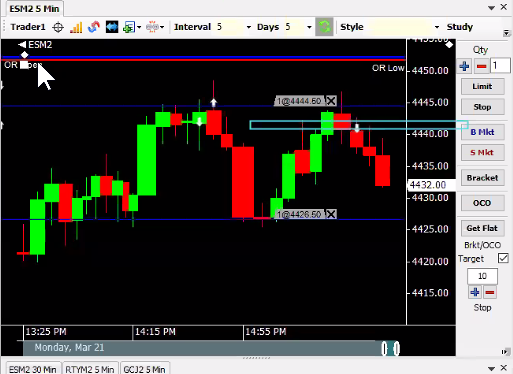

## Events
---
"For a 3/10 divergence you need a push outside the keltner channel on the diverging indicator. There needs to be something to diverge from"

Powell talking , 

didn't obey rule on slow south trade made it back on north trade rule still unclear on that side. 

## Charts
---




  



  




## Screenshots
---

