## Events
---

North trade the rule is still unclear.  
Should it be the break of the last or  
the break of the high or the open after the first red bar down  
Pocket trade  
.

## Charts
---




  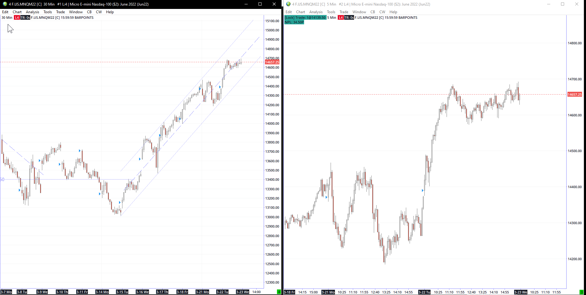



  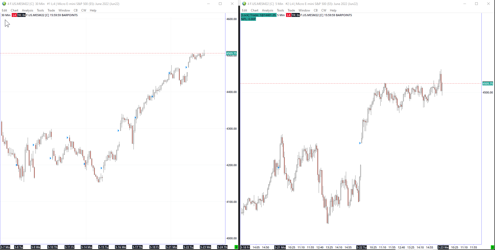



  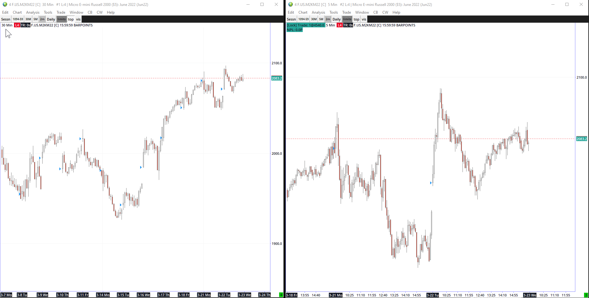



  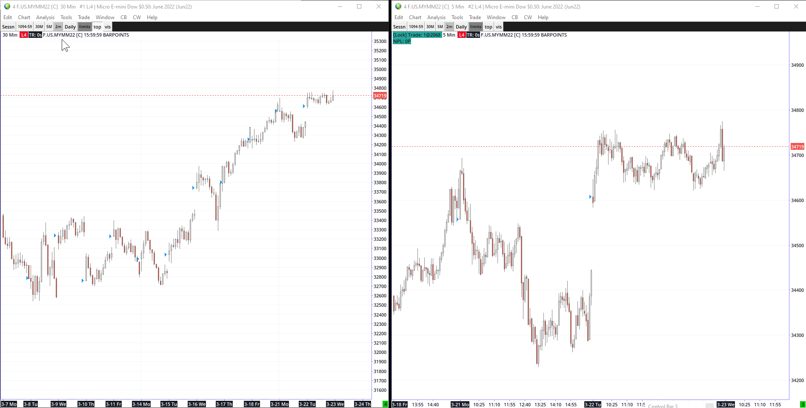




## Screenshots
---

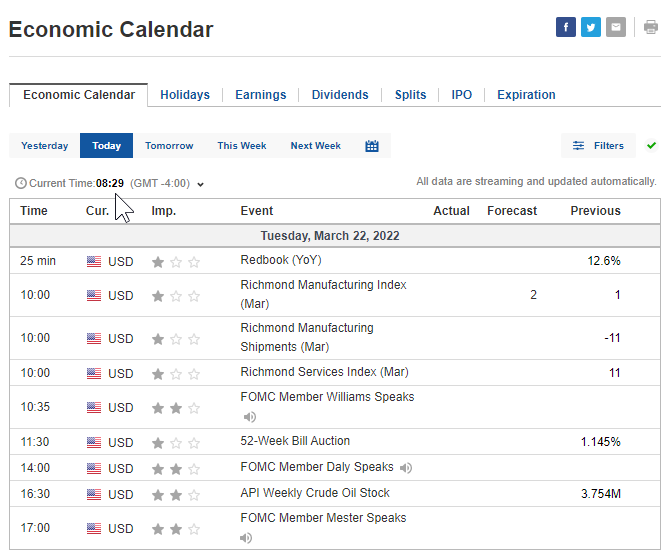

---
## Damon Trades




  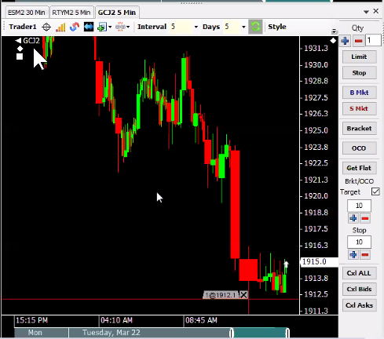

 

 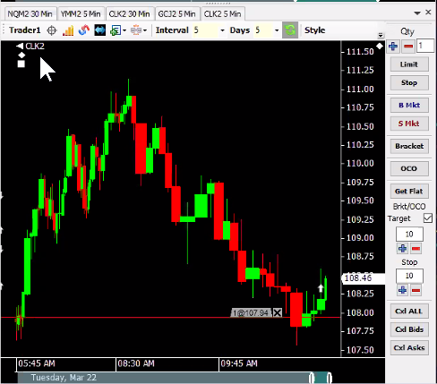

 

  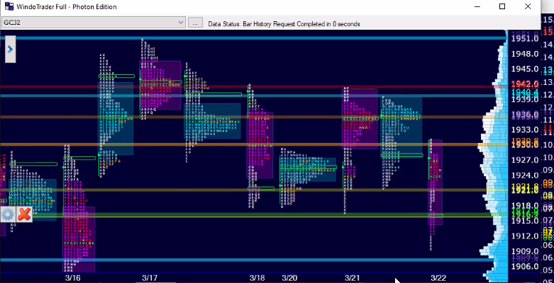



 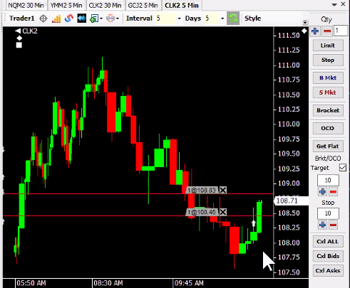



 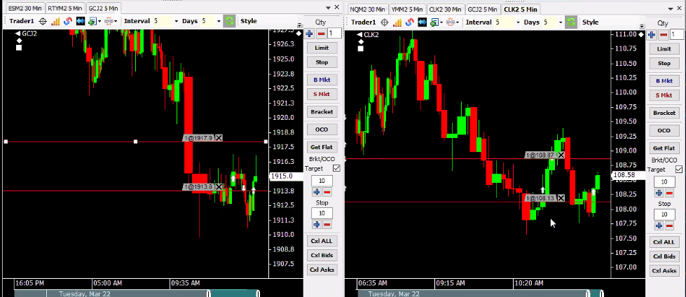



 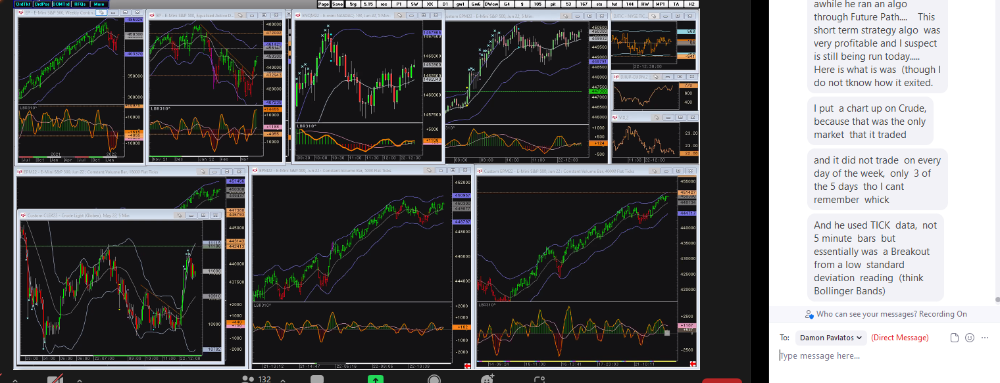




