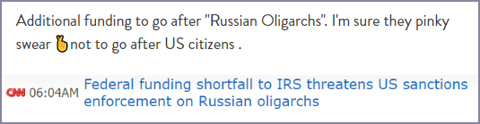

## Events

with conversations about losing dollar dominance happening, here is a dashboard to follow.

https://www.newyorkfed.org/markets/data-hub

---

https://www.dtcc.com/charts/daily-total-us-treasury-trade-fails

---

---

Older vid but --with all the sanctioning going on -- consider watching this if you want to scratch the surface of your understanding about repo markets, market liquidity and some of the plumbing behind how the global US Dollar financial system works.

Jeffrey Snider Alhambra Investment

https://www.youtube.com/watch?v=-jxpenWInjw

## Charts

---

## Screenshots

